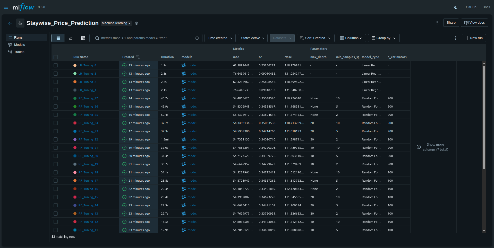
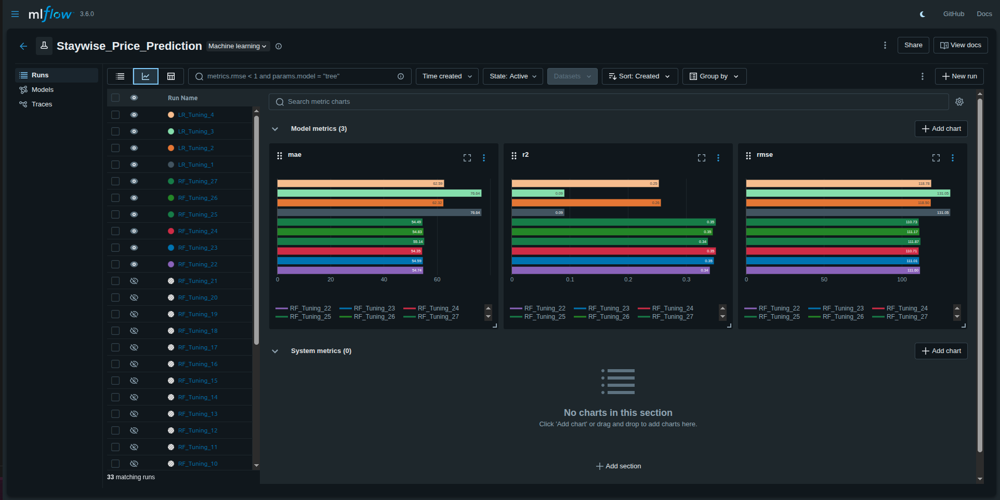
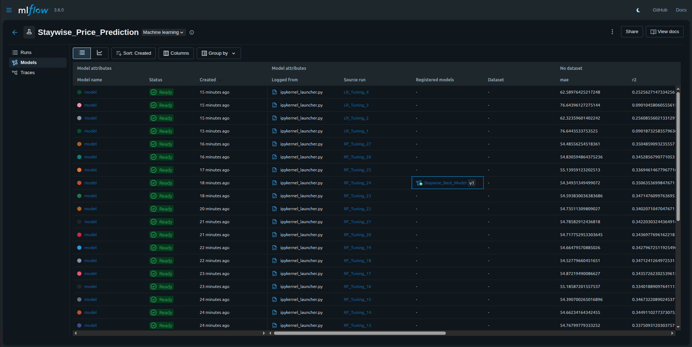

# StayWise Price Predictor

## Project Overview
StayWise is a global vacation rental platform aiming to help hosts set competitive nightly rates. This project implements a machine learning pipeline to predict optimal listing prices based on location, amenities, and other property characteristics.

The solution leverages **AWS S3** for raw data storage and **MLflow** for comprehensive experiment tracking and model management.

### Objectives
1.  **Data Ingestion**: Retrieve raw listing data securely from AWS S3.
2.  **Preprocessing**: Clean noisy data, handle missing values, remove outliers.
3.  **Modeling**: Develop and compare regression models (Linear Regression, Random Forest) to predict nightly prices.
4.  **Experiment Tracking**: Use MLflow to log parameters, metrics (RMSE, MAE, R2), and artifacts for every run.
5.  **Model Registry**: Identify and register the best-performing model for potential deployment.

## Setup and Execution

### Prerequisites
*   Python 3+
*   AWS Credentials (configured via `.env` or AWS CLI)
*   Virtual Environment (recommended)

### Installation
1.  **Clone the repository:**
    ```bash
    git clone <repository-url>
    cd staywise_price_predictor
    ```

2.  **Install dependencies:**
    ```bash
    pip install -r requirements.txt
    ```

3.  **Configure Environment:**
    Create a `.env` file in the root directory with your AWS credentials:
    ```bash
    AWS_ACCESS_KEY_ID=your_access_key
    AWS_SECRET_ACCESS_KEY=your_secret_key
    ```

### Running the Project
1.  **Launch the Jupyter Notebook:**
    Load the notebook in your desired IDE and execute the cells sequentially to download data, preprocess it, and train models.

2.  **View MLflow UI:**
    To inspect experiments and compare runs, start the MLflow UI server:
    ```bash
    mlflow ui
    ```
    Open [http://127.0.0.1:5000](http://127.0.0.1:5000) in your browser.

---

## Repository Structure

```
staywise_price_predictor/
├── data/                   # Local storage for downloaded datasets
├── mlruns/                 # MLflow tracking data (experiments & runs)
├── staywise_price_predictor.ipynb  # Main project notebook
├── requirements.txt        # Python dependencies
├── .env                    # Environment variables (not committed)
└── README.md               # Project documentation
```

### Workflow
1.  **Ingest**: The notebook downloads `AB_NYC_2019.csv` from the configured S3 bucket.
2.  **Clean & Handle Outliers**: 
    *   Irrelevant columns are dropped and missing values are filled.
    *   **Outlier Handling**: Listings with prices above $2000 are removed to reduce skewness. Minimum nights are capped at 365 days.
3.  **Engineer**: 
    *   Categorical variables (`neighbourhood_group`, `room_type`) are One-Hot Encoded.
    *   High-cardinality `neighbourhood` is Frequency Encoded.
4.  **Train & Track**: Models are trained iteratively. MLflow logs hyperparameters (e.g., `n_estimators`) and evaluation metrics.
5.  **Select**: The notebook programmatically queries MLflow to find the run with the lowest RMSE and registers it.

---

## Key Insights & Observations

*   **Price Distribution**: The raw price data is highly right-skewed. Outliers were handled by capping prices at $2000 as there isn't enough data to accurately predict prices of luxury listings.
*   **Feature Importance**: Analysis of the Random Forest model reveals that **Room Type** and **Location** are the most significant drivers of price. **Availability** and **Minimum Nights** also play a role, though to a lesser extent.
*   **Model Performance**: 
    *   **Random Forest** consistently outperformed Linear Regression, capturing non-linear relationships between location and price.
    *   Hyperparameter tuning (Grid Search) further optimized the Random Forest, reducing RMSE.

---

## MLflow Screenshots

### Experiment Runs

*Overview of different experiment runs and their status.*

### Metric Comparison

*Comparing RMSE across all runs.*

### Model Registry

*The final registered "Staywise_Best_Model" ready for staging.*